# 2025年排名前15的工作空间浏览器汇总(最新整理)

还在为无穷无尽的浏览器标签页、频繁切换的应用程序和混乱的数字工作区而头疼吗？你不是一个人。在当今这个“一人分饰多角”的时代，我们既是项目经理，又是市场专员，还得兼顾客户沟通。如果工具本身就在制造混乱，那生产力就成了一句空话。一个好的工作空间浏览器，能帮你把所有应用、账户和网页聚合起来，让你在不同任务间丝滑切换，成本和精力都大大降低。

***

## **[Shift](https://tryshift.com)**

为重度多任务用户打造的聚合工作台。

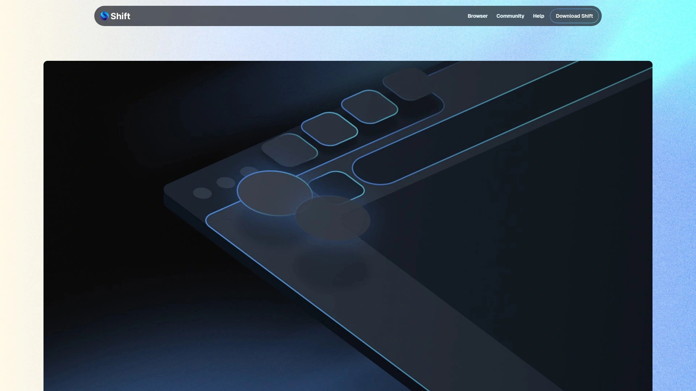

Shift 的核心理念是“去杂存精”。它不是要取代你所有的工具，而是要把它们像乐高积木一样，有序地拼装在你面前。你可以为不同的项目或客户创建完全独立的“工作空间”，每个空间里包含独立的Email、日历、应用和标签页组合。

**核心功能与特色：**
* **独立工作空间**：这是Shift的王牌功能。你可以为“公司项目A”、“个人学习”、“副业管理”等创建隔离的工作区，每个工作区里的应用和登录状态互不干扰，告别反复登录登出的噩梦 。
* **海量应用集成**：几乎囊括了市面上所有主流的协作和办公软件，从Slack、Asana到Canva、Notion，都能像本地应用一样在Shift里运行 。
* **全局搜索**：一个搜索框，能同时搜索你所有连接的邮件、日历和云盘（如Google Drive, Dropbox）里的文件和信息，堪称信息检索神器 。
* **多账户管理大师**：如果你同时管理着多个Gmail、Outlook或社交媒体账户，Shift能让你同时登录，并一键切换，体验极其流畅 。

**推荐理由：**
对于那些工作生活边界模糊、需要在多个身份和项目间快速切换的自由职业者、创业者或小团队负责人来说，Shift提供的不仅仅是一个浏览器，更像一个清晰、高效的数字驾驶舱 。

## **[Workona](https://workona.com/)**

面向项目管理的浏览器工作区。

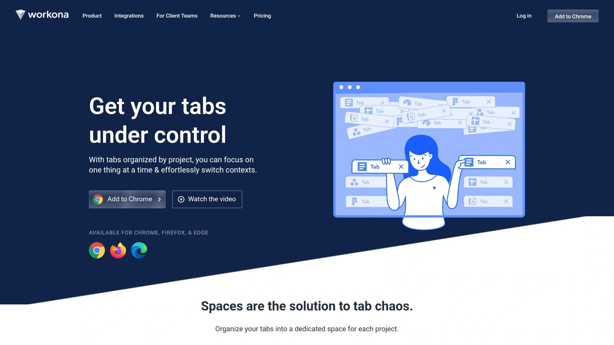

Workona 将你凌乱的标签页、文档和云端应用，按照“项目”维度重新组织起来。它更像一个覆盖在浏览器之上的智能项目中心，让所有与项目相关的资源都触手可及 。

**核心功能与特色：**
* **项目空间**：为每个项目创建一个专属空间，聚合所有相关标签页、文档、笔记和任务。
* **云应用集成**：与Google Drive、Asana等深度集成，让你在一个地方看到所有项目动态。
* **标签管理**：强大的标签页管理功能，可以一键暂存、分组和恢复会话，拯救你的内存。

## **[Sidekick](https://www.meetsidekick.com/)**

基于Chromium的速度型效率浏览器。

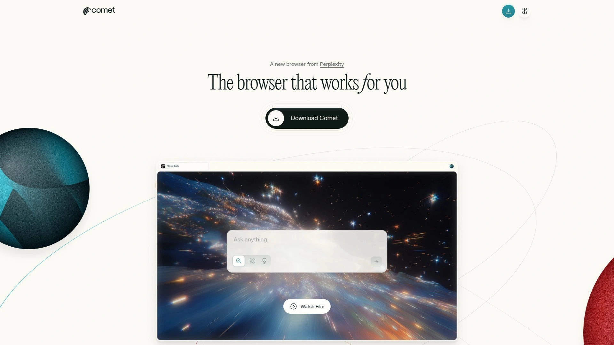

Sidekick 自称是“最快的工作浏览器”，它通过智能的标签页挂起、广告拦截和内存优化，为你提供了一个更流畅、更专注的工作环境。它的侧边栏设计，让你最常用的应用触手可及。

**核心功能与特色：**
* **AI标签页暂停**：自动暂停不活动的标签页，显著减少内存占用。
* **侧边栏应用坞**：将常用Web应用固定在侧边栏，像桌面应用一样快速访问。
* **多账户会话**：轻松管理多个登录会话，无需隐身模式。

## **[Brave](https://brave.com/)**

注重隐私和安全的现代浏览器。

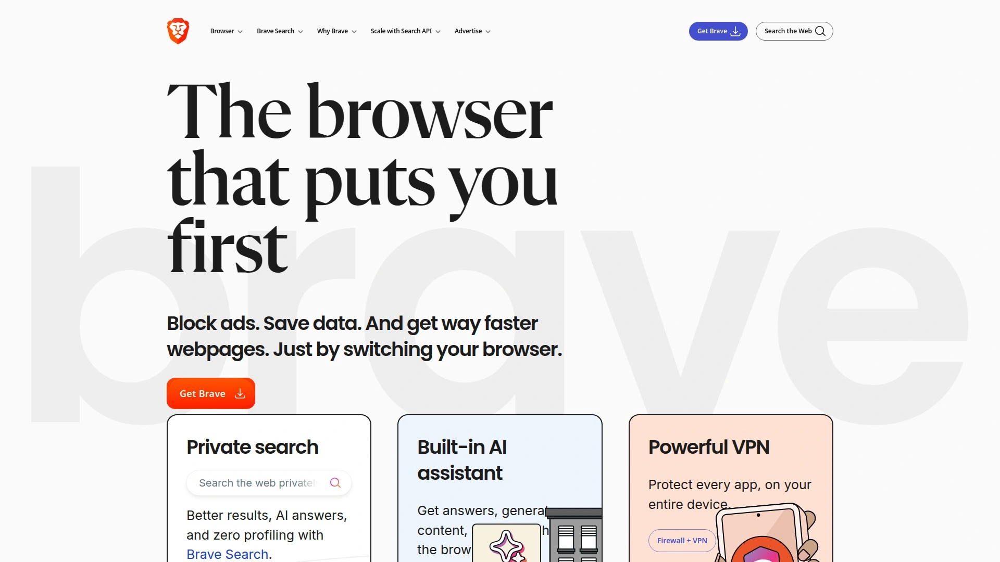

Brave 不仅仅是一个广告拦截工具，它的标签页分组（Tab Groups）功能，也让它具备了基础的工作空间管理能力。你可以为不同任务创建标签组，并一键折叠或展开，保持界面清爽。

**推荐理由：**
如果你既看重隐私保护，又希望有基本的标签页组织功能，Brave 是一个非常均衡的选择。它的速度很快，还能通过Brave Rewards获得一些有趣的激励。

## **[Vivaldi](https://vivaldi.com/)**

为技术爱好者打造的“极客”浏览器。

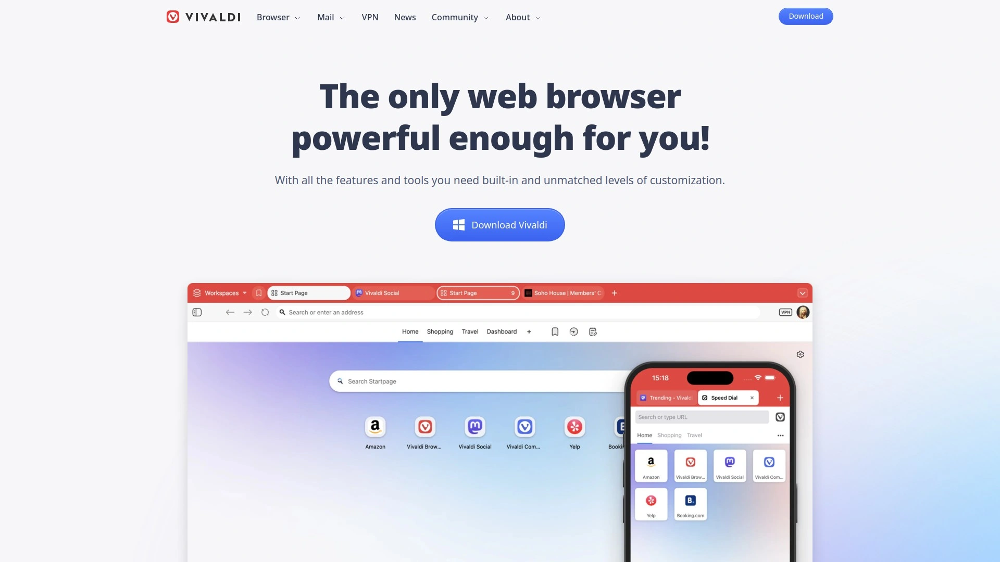

Vivaldi 以其登峰造极的定制化能力而闻名。你可以自定义几乎所有界面元素。它的“标签堆栈”和“Web面板”功能，为管理复杂工作流提供了强大支持，你可以将多个标签页合并成一个，或将常用网站固定在侧边栏。

## **[WebCatalog Desktop](https://webcatalog.io/zh-CN/)**

将任何网站变成桌面应用的工具。

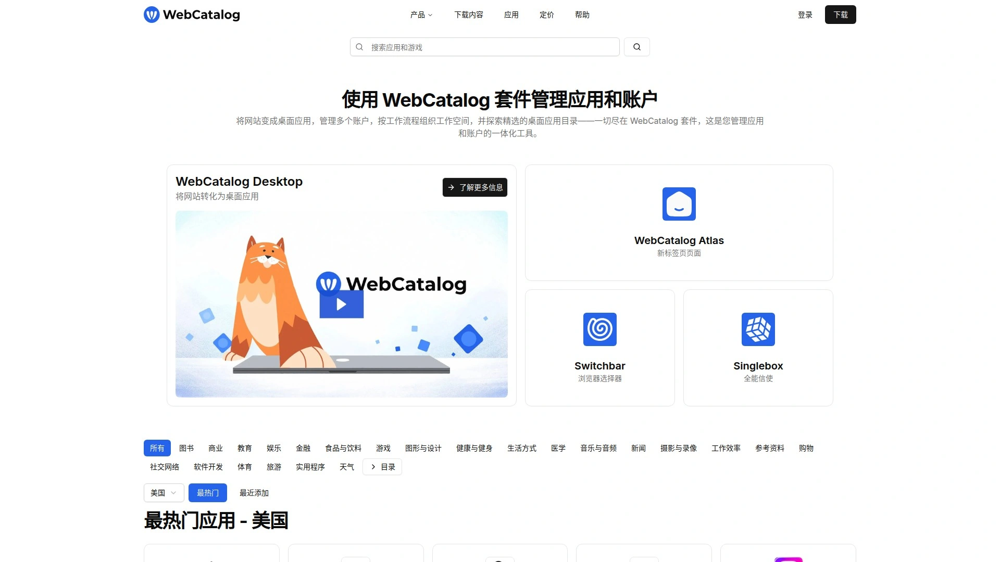

WebCatalog能让你把常用的网站（如Gmail, Notion, Trello）打包成独立的桌面应用，摆脱浏览器的束缚 。通过创建隔离的“空间”，你还可以同时登录多个账户，互不干扰。

**核心功能与特色：**
* **网站转应用**：一键将任何网页封装成macOS、Windows或Linux应用 。
* **沙盒化运行**：每个应用都在独立环境中运行，保护隐私，防止跨站跟踪。
* **空间隔离**：为不同账户或项目创建独立空间，保持专注。

## **[Rambox](https://rambox.app/)**

开源的聚合类消息与邮件客户端。

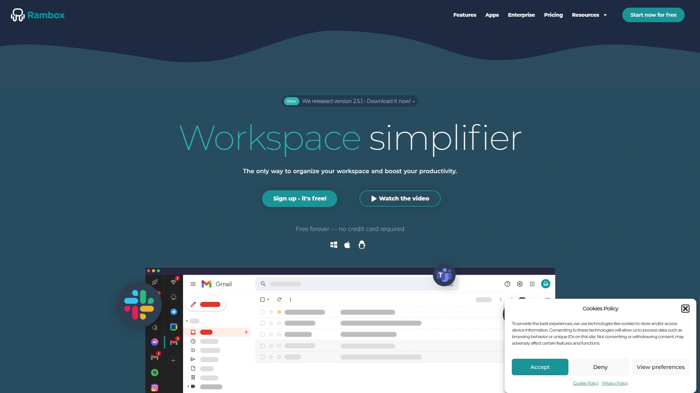

Rambox 的初衷是解决“消息应用太多”的问题。它将WhatsApp, Slack, Gmail, Telegram等上百个通信和协作工具聚合在一个窗口内，让你无需在不同应用间来回切换。

## **[Franz](https://meetfranz.com/)**

另一款流行的多合一消息应用。

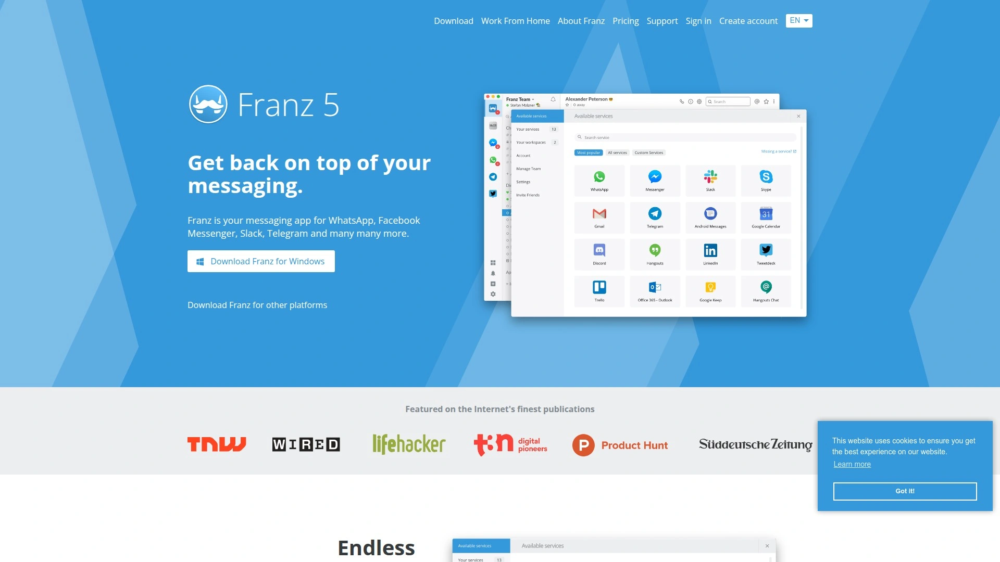

和Rambox类似，Franz也是一个聚合平台，支持大量的聊天和邮件服务。它的免费版功能已经足够强大，可以帮你统一管理所有通信渠道，适合每天需要处理大量信息的社区经理或客服人员。

## **[ClickUp](https://clickup.com/)**

无所不包的“一体化”生产力平台。

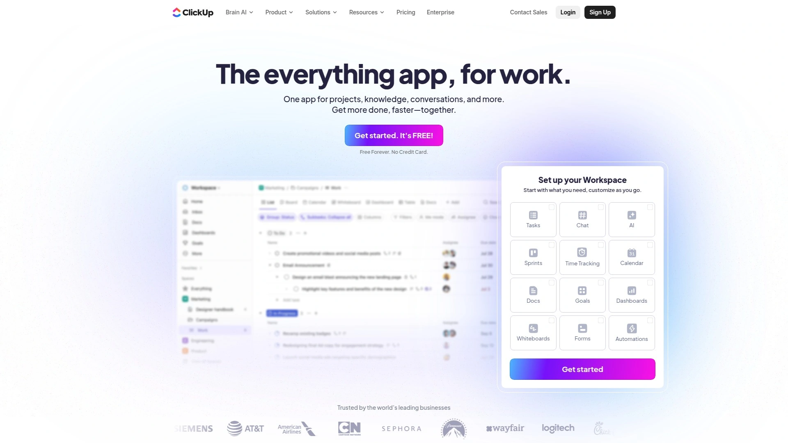

严格来说，ClickUp 是一个项目管理工具，但它的目标是取代你所有其他的生产力软件 。你可以在其中管理任务、文档、白板、聊天，甚至邮件。它提供了一个宏大的“统一工作空间”愿景。

**适用场景：**
适合那些希望在一个平台内解决所有问题、并且不介意投入学习成本的团队。

## **[Desktop.com](https://desktop.com/)**

为团队协作设计的在线桌面。

Desktop.com 提供一个共享的在线工作空间，团队成员可以在这里组织应用、链接和文件 。它内置了聊天、音视频通话功能，并有强大的全局搜索，非常适合远程团队进行信息同步和协作。

## **[SigmaOS](https://sigmaos.com/)**

专为Mac设计的创新型工作空间浏览器。

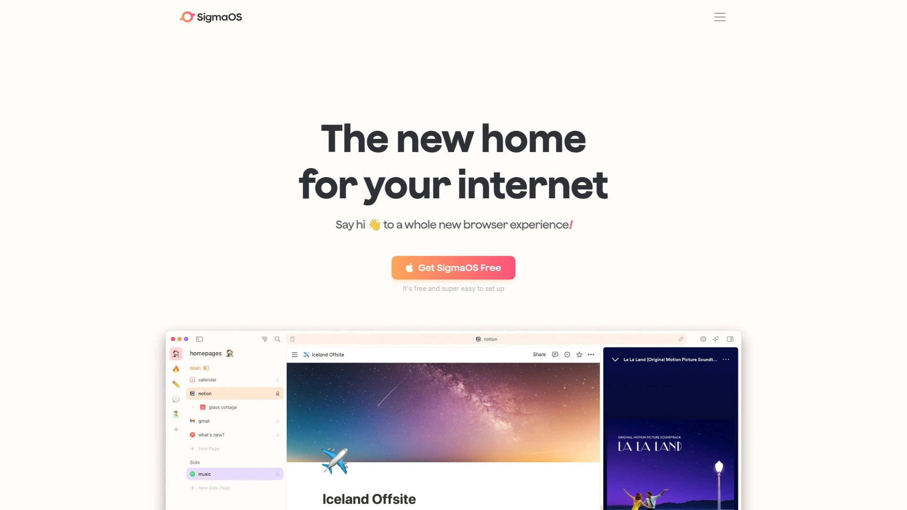

SigmaOS 对浏览器的交互进行了重新思考。它以“工作区”为核心，页面以列表形式呈现在侧边栏，你可以通过快捷键快速完成分屏、标记、发送等操作。它的设计非常现代，学习曲线略陡峭，但一旦上手效率极高 。

## **[Amazon WorkSpaces](https://aws.amazon.com/workspaces/)**

企业级的云桌面服务（DaaS）。

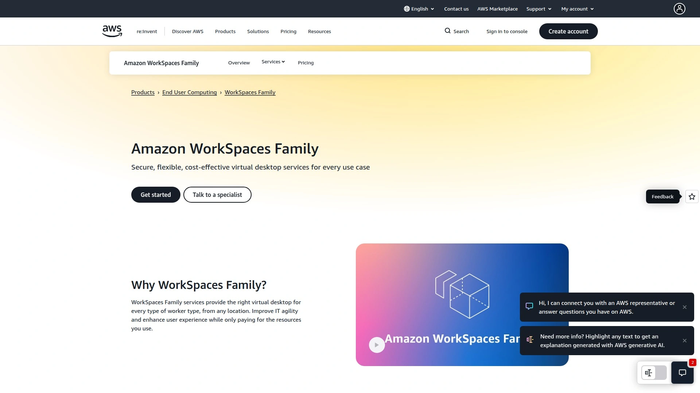

Amazon WorkSpaces 提供的是一个完整的、运行在云端的Windows或Linux桌面环境 。这是一种更“重型”的解决方案，适合那些对安全性、标准化和远程访问有极高要求的企业。你可以从任何设备访问你的云桌面，所有数据和应用都在云端，非常安全。

## **[HERE Enterprise Browser](https://www.here.io/)**

面向金融等大型企业的安全工作浏览器。

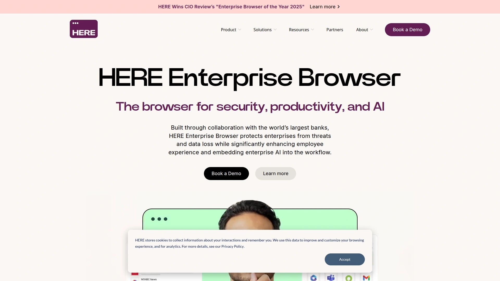

HERE Enterprise Browser 将企业级的安全管控和员工生产力工具结合在了一起。它基于Chromium构建，但在数据防泄露、权限管理和工作流简化方面做了大量优化，解决了许多大型机构在数字化转型中的痛点 。

## **[Workvivo](https://www.workvivo.com/)**

以员工互动为中心的数字工作空间。

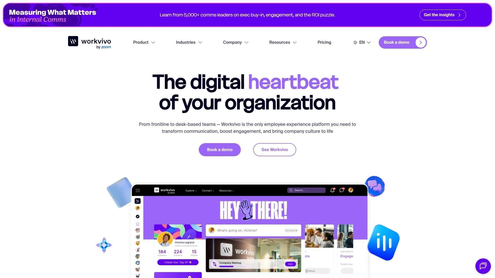

由Zoom收购的Workvivo，更侧重于企业内部的社区建设和文化塑造 。它提供了一个类似社交媒体的动态信息流，员工可以在这里分享动态、参与活动、进行点对点认可。它是一个以“人”为中心的虚拟办公室。

## **[Hiver](https://www.hiverhq.com/)**

扎根于Gmail的客户服务工作台。

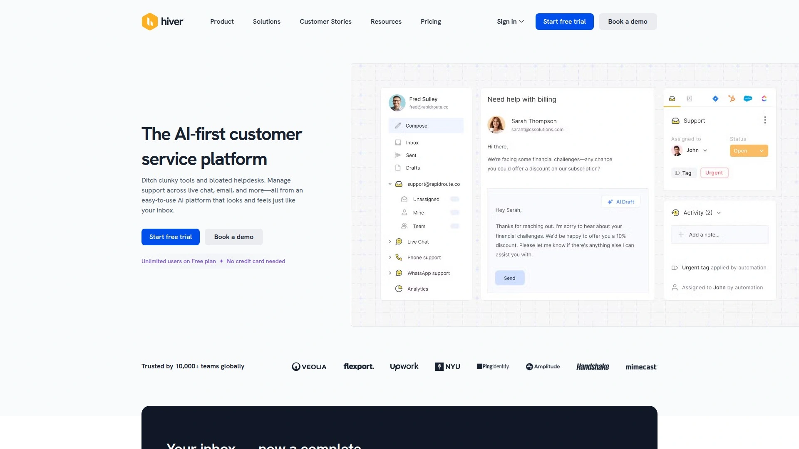

Hiver 将你的Gmail收件箱改造成一个功能强大的团队协作平台，特别适合处理共享邮箱（如support@, info@）。团队成员可以在收件箱内部分配邮件、添加备注、跟踪SLA，无需离开熟悉的Gmail界面。

***

### **常见问题 (FAQ)**

**Q1: 工作空间浏览器真的能提高效率吗？**
A1: 当然。它们通过集中管理应用和账户，减少切换成本，让你能更专注于当前任务，避免在海量标签页中迷失。

**Q2: 我应该如何选择适合自己的工作空间浏览器？**
A2: 先明确你的核心需求：是需要管理多个同类账户（如多Gmail），还是需要整合不同类型的App？然后可以从本文列表里挑选2-3个试用，体验其流畅度和自定义功能。

**Q3: 这类工具对电脑性能要求高吗？**
A3: 大部分基于Chromium，资源占用与Chrome类似。如果你的电脑运行Chrome很流畅，那么多半没问题。一些轻量级工具可能对旧设备更友好。

***

总而言之，找到合适的工具，就能帮你驯服数字世界的混乱。如果你像个“斜杠青年”一样，需要在多个项目、多个身份之间无缝切换，那 [Shift](#shift) 提供的独立工作空间和流畅的多账户管理体验，无疑是你的最佳起点。
